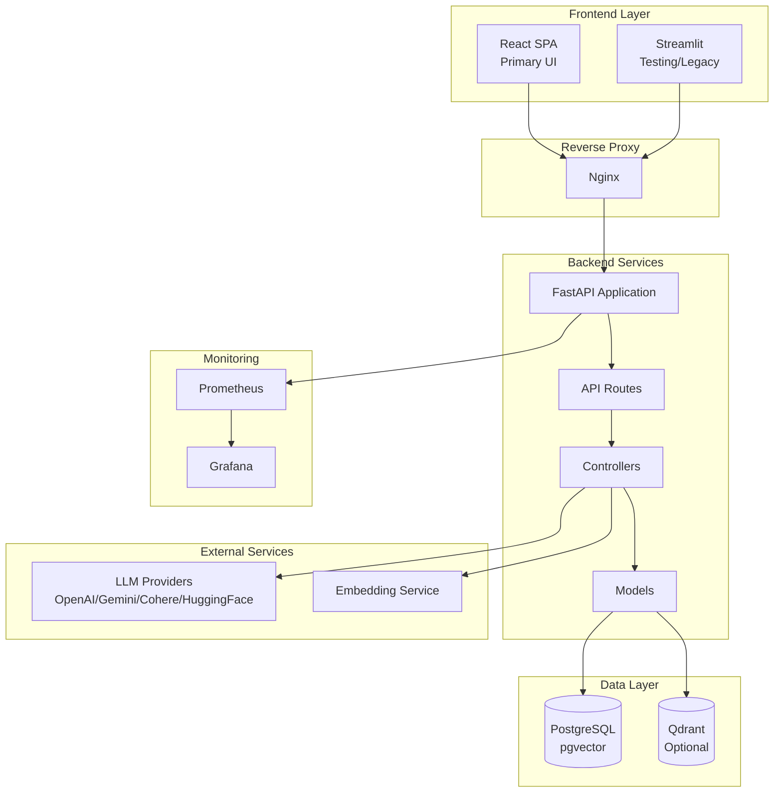

# Fehres

A Retrieval-Augmented Generation (RAG) system for document-based question answering. Upload documents, process them into searchable chunks, and get AI-generated answers based on your content.

## Features

- **Modern React Frontend**: Accessible SPA built with React 18, TypeScript, and React Aria Components
- **Learning Assistant**: Dedicated AI assistant for AI/Data Science references corpus
- **Multi-format Document Support**: PDF, TXT, Markdown, JSON, CSV, DOCX
- **Multiple LLM Providers**: OpenAI, Google Gemini, Cohere, HuggingFace, Ollama (local)
- **Vector Database Options**: PostgreSQL with pgvector, Qdrant
- **RESTful API**: FastAPI backend with OpenAPI documentation
- **Monitoring**: Prometheus metrics and Grafana dashboards
- **Docker Ready**: Full containerized deployment with Docker Compose

## Architecture



## Quick Start

### Prerequisites

- Python 3.11.14+
- [uv](https://github.com/astral-sh/uv) (recommended) or pip
- Docker and Docker Compose (for containerized deployment)

### One-Command Startup (Recommended)

The easiest way to run the full stack (Database, Backend, Frontend) is using the helper script:

```bash
# 1. Clone
git clone <repository-url>
cd fehres

# 2. Configure
cd SRC
cp .env.example .env
# Edit .env with your API keys!

# 3. Run
cd ..
./dev.sh
```

This script will:
1. Start PostgreSQL & Qdrant in Docker
2. Run database migrations
3. Start the FastAPI backend (port 8000)
4. Start the React frontend (port 5173)

### Manual Setup (Alternative)

If you prefer to run services individually:

#### 1. Databases

```bash
cd Docker
docker compose -f docker-compose.dev.yml up -d
```

Services will be available at:

- **React Frontend**: http://localhost (via Nginx)
- **API**: http://localhost:8000
- **Grafana**: http://localhost:3000
- **Prometheus**: http://localhost:9090

See [Docker/README.md](Docker/README.md) for detailed Docker configuration.

#### 2. Backend

```bash
cd SRC
# Install dependencies
uv sync
# Or: pip install -r requirements.txt

# Install Playwright browsers (for scraping)
uv run playwright install chromium

# Run migrations
uv run python -m alembic upgrade head

# Start API
uv run uvicorn main:app --reload --host 0.0.0.0 --port 8000
```

#### 3. Frontend

```bash
cd frontend
pnpm install
pnpm run dev
```

## Usage

### React Frontend (Recommended)

The modern React SPA provides an intuitive interface for all operations:

1. **Chat**: RAG Q&A with AI-generated answers based on your documents
2. **Upload & Process**: Upload documents, configure chunking, and process files
3. **Search**: Semantic search across indexed documents
4. **Index Info**: View vector database statistics
5. **Settings**: Configure API URL, project ID, and theme preferences

**Learning Assistant**: A dedicated interface for the AI/Data Science reference corpus. Ask questions about maths, statistics, coding, ML, DL, GenAI, and System Design.

### API Endpoints

1. **Upload** a document via `POST /api/v1/data/upload/{project_id}`
2. **Process** the document into chunks via `POST /api/v1/data/process/{project_id}`
3. **Index** chunks to the vector database via `POST /api/v1/nlp/index/push/{project_id}`
4. **Ask** questions via `POST /api/v1/nlp/index/answer/{project_id}`


For full API documentation, see [API.md](API.md).

## Project Structure

```
fehres/
├── SRC/                    # Backend - FastAPI application
│   ├── main.py             # Application entry point
│   ├── Routes/             # API endpoint definitions
│   ├── Controllers/        # Business logic
│   ├── Models/             # Data models and database schemas
│   ├── Stores/             # LLM and VectorDB integrations
│   └── Helpers/            # Configuration and utilities
├── frontend/               # React SPA frontend
│   ├── src/
│   │   ├── api/            # API clients and types
│   │   ├── components/     # UI components (ui, layout, features)
│   │   ├── pages/          # Page components
│   │   └── stores/         # Zustand state management
│   └── ...                 # Config files (vite, tsconfig, etc.)
├── Docker/                 # Docker configuration
├── streamlit_app/          # Testing frontend (legacy)
├── API.md                  # API reference
├── TESTING.md              # Testing documentation
└── README.md
```

## Configuration

Key environment variables (see `.env.example` for full list):

| Variable | Description |
| --- | --- |
| `GENRATION_BACKEND` | LLM provider: `OPENAI`, `GEMINI`, `COHERE`, `HUGGINGFACE`, or `OLLAMA` |
| `EMBEDDING_BACKEND` | Embedding provider |
| `VECTORDB_BACKEND` | Vector DB: `PGVECTOR` or `QDRANT` |
| `POSTGRES_*` | PostgreSQL connection settings |
| `*_API_KEY` | API keys for LLM providers |
| `SCRAPING_USE_BROWSER` | Set to `1` to use Playwright (slower, better quality), `0` for requests |
| `SCRAPING_CONCURRENCY` | Number of concurrent pages to scrape (if browser disabled) |

## Local Ollama Models

Use Ollama when you want fully local generation and embeddings.

### Recommended models (RTX 3060 12GB)

- **Generation**: `qwen3:8b`
- **Embeddings**: `qwen3-embedding:8b`

### Setup

1. Install and run Ollama: https://ollama.com
2. Pull models:

```bash
ollama pull qwen3:8b
ollama pull qwen3-embedding:8b
```

3. Update `.env`:

```bash
GENRATION_BACKEND="OLLAMA"
EMBEDDING_BACKEND="OLLAMA"
OLLAMA_BASE_URL="http://localhost:11434"
GENRATION_MODEL_ID="qwen3:8b"
EMBEDDING_MODEL_ID="qwen3-embedding:8b"
# Set EMBEDDING_SIZE to the model's output dimension (see model card)
```

## Tech Stack

### Backend

- **FastAPI** - Modern, fast web framework for building APIs
- **PostgreSQL with pgvector** / **Qdrant** - Vector databases
- **Alembic** - Database migrations

### Frontend

- **React 18** - UI library with hooks
- **TypeScript** - Type safety
- **Vite** - Fast build tool and dev server
- **React Router v6** - Client-side routing
- **TanStack Query** - Server state management
- **Zustand** - Client state management
- **React Aria Components** - Accessible UI primitives
- **Tailwind CSS** - Utility-first styling

### DevOps & Monitoring

- **Docker & Docker Compose** - Containerization
- **Nginx** - Reverse proxy
- **Prometheus** - Metrics collection
- **Grafana** - Visualization dashboards

## Testing

### Verify Server

```bash
uv run python verify.py
```

### React Frontend

```bash
cd frontend
pnpm install
pnpm run dev
```

Access the React frontend at `http://localhost:5173`.

### Streamlit UI (Legacy)

```bash
cd streamlit_app
pip install -r requirements.txt
streamlit run app.py
```

See [streamlit_app/README.md](streamlit_app/README.md) for more details.

### Testing the documentation scraper

Use these steps to verify scraping and to see why a site might return 0 pages.

**1. One-URL debug (no full scrape)**  
With the backend running (e.g. `docker compose up` or local FastAPI on port 8000), call the debug endpoint with the URL you want to scrape. It returns raw HTML length, extracted text length, and a short snippet so you can see if the problem is “server returns little HTML” or “extraction strips everything”.

```bash
# Replace the URL if needed; backend must be on port 8000 (or use your API base URL)
curl "http://localhost:8000/api/v1/data/scrape-debug?url=https://docs.flet.dev/"
```

Example response:

```json
{
  "url": "https://docs.flet.dev/",
  "status_code": 200,
  "content_type": "text/html; charset=utf-8",
  "html_len": 125000,
  "extracted_len": 8400,
  "extracted_snippet": "Introduction Flet is a framework...",
  "error": null
}
```

- Scraping uses **Playwright** (headless Chromium) by default (`SCRAPING_USE_BROWSER=1`). After `uv sync`, run once: `uv run playwright install chromium`.
- If `html_len` is large but `extracted_len` is small, check logs or set `SCRAPING_DEBUG=1` to inspect the first URL.

**2. Full scrape from the UI**

1. Open the app (e.g. http://localhost:5173 or http://localhost).
2. Go to **Library docs** (or the page where you enter a documentation URL).
3. Enter the base URL (e.g. `https://docs.flet.dev/`) and start the scrape.
4. In the backend logs (e.g. `docker compose logs -f fastapi`), you’ll see:
   - Per-page skip reasons: `non-200`, `non-html`, `insufficient_content extracted_len=...`, or `exception ...`
   - If `SCRAPING_DEBUG=1` in your env, the first URL also logs `html_len`, `extracted_len`, and a snippet.

**3. Optional: enable debug for the first URL**

In your backend env (e.g. `Docker/env/.env.app` or `.env`), set:

```bash
SCRAPING_DEBUG=1
```

Restart the backend and run a scrape; the first URL’s debug line will appear in the logs.

See [TESTING.md](TESTING.md) for comprehensive testing documentation.

## License

Apache License 2.0 - see [LICENCE](LICENCE) for details.

## Self-Hosting Guide

Turn an old computer into a professional server for your "Fehres" project using **Self-Hosting**. This setup bypasses home network restrictions using Cloudflare Tunnel.

### Phase 1: The Hardware & OS

**Hardware Requirements:**
- **Computer**: An old laptop (recommended for built-in battery/UPS) or desktop PC.
- **RAM**: 4GB minimum.
- **Connection**: Connect via Ethernet cable for stability.

**OS Installation:**
1. Download **Ubuntu Server 24.04 LTS**.
2. Flash it to a USB stick (using Rufus or BalenaEtcher).
3. Install on your computer. **Important**: Check the box "Install OpenSSH Server" during installation.

### Phase 2: Install Project

Login via SSH: `ssh your_username@local_ip`

**1. Install Docker Engine**

```bash
# Add Docker's official GPG key:
sudo apt-get update
sudo apt-get install ca-certificates curl
sudo install -m 0755 -d /etc/apt/keyrings
sudo curl -fsSL https://download.docker.com/linux/ubuntu/gpg -o /etc/apt/keyrings/docker.asc
sudo chmod a+r /etc/apt/keyrings/docker.asc

# Add the repository to Apt sources:
echo \
  "deb [arch=$(dpkg --print-architecture) signed-by=/etc/apt/keyrings/docker.asc] https://download.docker.com/linux/ubuntu \
  $(. /etc/os-release && echo "$VERSION_CODENAME") stable" | \
  sudo tee /etc/apt/sources.list.d/docker.list > /dev/null
sudo apt-get update

# Install Docker
sudo apt-get install docker-ce docker-ce-cli containerd.io docker-buildx-plugin docker-compose-plugin
```

**2. Clone and Configure**

```bash
git clone https://github.com/mohamedfathi540/fehres.git
cd fehres/Docker

# Create your .env files (ensure detailed configuration)
# START THE APP
docker compose up -d --build
```

> **Note**: Ensure you are using the updated Nginx configuration to correctly serve both Frontend and API.

### Phase 3: Expose to the Internet (Cloudflare Tunnel)

Bypass dynamic IPs and blocked ports using a secure tunnel.

**1. Install cloudflared**

```bash
curl -L --output cloudflared.deb https://github.com/cloudflare/cloudflared/releases/latest/download/cloudflared-linux-amd64.deb
sudo dpkg -i cloudflared.deb
```

**2. Start a Temporary Tunnel**

```bash
cloudflared tunnel --url http://localhost:80
```
This will print a random public URL (e.g., `https://random-name.trycloudflare.com`). Test this link to see your project.

**3. Make it Permanent (Production)**
- Sign up for a free Cloudflare account.
- Go to **Zero Trust Dashboard > Networks > Tunnels**.
- Create a Tunnel and follow instructions to install the connector.
- **Configure Public Hostname**:
  - Public Hostname: `fehres.yourdomain.com`
  - Service: `HTTP -> localhost:80`

### Troubleshooting

**Error: "Cannot connect to the Docker daemon"**
If `docker compose up` fails with this error, try these fixes:

**Solution 1: Switch Context (Most Common Fix)**
```bash
docker context use default
```

**Solution 2: Start Docker Service**
```bash
sudo systemctl start docker
sudo systemctl enable docker
```

**Warning: Electricity & Data**
- **Electricity**: Configure BIOS to "Power On After Power Failure".
- **Data Usage**: Hosting AI models and files consumes quota. Monitor your internet usage.


