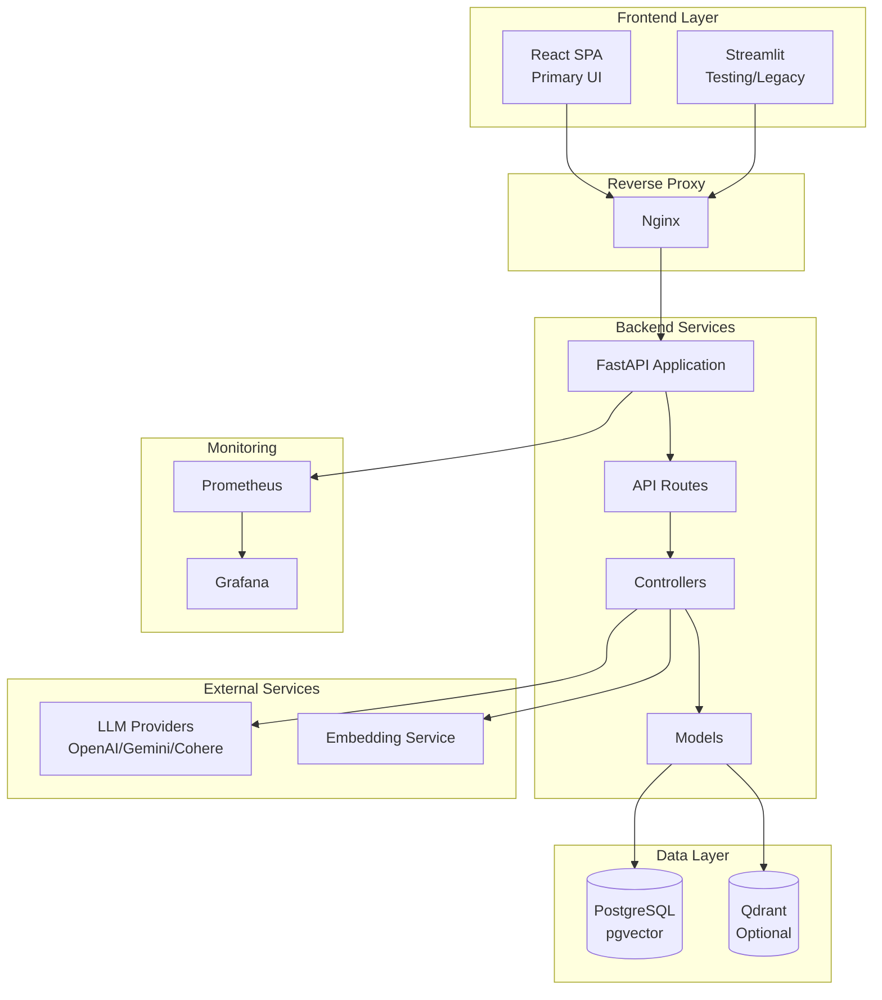

# Fehres

A Retrieval-Augmented Generation (RAG) system for document-based question answering. Upload documents, process them into searchable chunks, and get AI-generated answers based on your content.

## Features

- **Modern React Frontend**: Accessible SPA built with React 18, TypeScript, and React Aria Components
- **Learning Assistant**: Dedicated AI assistant for AI/Data Science references corpus
- **Multi-format Document Support**: PDF, TXT, Markdown, JSON, CSV, DOCX
- **Multiple LLM Providers**: OpenAI, Google Gemini, Cohere
- **Vector Database Options**: PostgreSQL with pgvector, Qdrant
- **RESTful API**: FastAPI backend with OpenAPI documentation
- **Monitoring**: Prometheus metrics and Grafana dashboards
- **Docker Ready**: Full containerized deployment with Docker Compose

## Architecture



## Quick Start

### Prerequisites

- Python 3.11.14+
- [uv](https://github.com/astral-sh/uv) (recommended) or pip
- Docker and Docker Compose (for containerized deployment)

### Local Development

#### 1. Clone the repository

```bash
git clone <repository-url>
cd fehres
```

#### 2. Set up Backend

```bash
cd SRC
cp .env.example .env
# Edit .env with your API keys and database credentials
```

Install dependencies:

```bash
uv sync
# or: pip install -r requirements.txt
```

Run database migrations:

```bash
uv run python -m alembic upgrade head
```

Start the server:

```bash
uv run uvicorn main:app --reload --host 0.0.0.0 --port 8000
```

#### 3. Set up Frontend (Optional - for React UI)

```bash
cd frontend
pnpm install
pnpm run dev
```

The React frontend will be available at `http://localhost:5777`.

#### 4. Access the Services

- **React Frontend**: http://localhost:5777
- **API Documentation**: http://localhost:8000/docs

### Docker Deployment

```bash
cd Docker
docker compose up -d
```

Services will be available at:

- **React Frontend**: http://localhost (via Nginx)
- **API**: http://localhost:8000
- **Grafana**: http://localhost:3000
- **Prometheus**: http://localhost:9090

See [Docker/README.md](Docker/README.md) for detailed Docker configuration.

## Usage

### React Frontend (Recommended)

The modern React SPA provides an intuitive interface for all operations:

1. **Chat**: RAG Q&A with AI-generated answers based on your documents
2. **Upload & Process**: Upload documents, configure chunking, and process files
3. **Search**: Semantic search across indexed documents
4. **Index Info**: View vector database statistics
5. **Settings**: Configure API URL, project ID, and theme preferences

**Learning Assistant**: A dedicated interface for the AI/Data Science reference corpus (project ID 10). Ask questions about maths, statistics, coding, ML, DL, GenAI, and System Design.

### API Endpoints

1. **Upload** a document via `POST /api/v1/data/upload/{project_id}`
2. **Process** the document into chunks via `POST /api/v1/data/process/{project_id}`
3. **Index** chunks to the vector database via `POST /api/v1/nlp/index/push/{project_id}`
4. **Ask** questions via `POST /api/v1/nlp/index/answer/{project_id}`

**Learning books corpus**: The project ID set by `LEARNING_BOOKS_PROJECT_ID` (default: 10) is reserved for the AI/Data Science references corpus (maths, statistics, coding, ML, DL, GenAI, system design). Use this fixed ID for upload, process, index, and search when using the learning assistant.

For full API documentation, see [API.md](API.md).

## Project Structure

```
fehres/
├── SRC/                    # Backend - FastAPI application
│   ├── main.py             # Application entry point
│   ├── Routes/             # API endpoint definitions
│   ├── Controllers/        # Business logic
│   ├── Models/             # Data models and database schemas
│   ├── Stores/             # LLM and VectorDB integrations
│   └── Helpers/            # Configuration and utilities
├── frontend/               # React SPA frontend
│   ├── src/
│   │   ├── api/            # API clients and types
│   │   ├── components/     # UI components (ui, layout, features)
│   │   ├── pages/          # Page components
│   │   └── stores/         # Zustand state management
│   └── ...                 # Config files (vite, tsconfig, etc.)
├── Docker/                 # Docker configuration
├── streamlit_app/          # Testing frontend (legacy)
├── API.md                  # API reference
├── TESTING.md              # Testing documentation
└── README.md
```

## Configuration

Key environment variables (see `.env.example` for full list):

| Variable            | Description                                   |
| ------------------- | --------------------------------------------- |
| `GENRATION_BACKEND` | LLM provider: `OPENAI`, `GEMINI`, or `COHERE` |
| `EMBEDDING_BACKEND` | Embedding provider                            |
| `VECTORDB_BACKEND`  | Vector DB: `PGVECTOR` or `QDRANT`             |
| `POSTGRES_*`        | PostgreSQL connection settings                |
| `*_API_KEY`         | API keys for LLM providers                    |

## Tech Stack

### Backend

- **FastAPI** - Modern, fast web framework for building APIs
- **PostgreSQL with pgvector** / **Qdrant** - Vector databases
- **Alembic** - Database migrations

### Frontend

- **React 18** - UI library with hooks
- **TypeScript** - Type safety
- **Vite** - Fast build tool and dev server
- **React Router v6** - Client-side routing
- **TanStack Query** - Server state management
- **Zustand** - Client state management
- **React Aria Components** - Accessible UI primitives
- **Tailwind CSS** - Utility-first styling

### DevOps & Monitoring

- **Docker & Docker Compose** - Containerization
- **Nginx** - Reverse proxy
- **Prometheus** - Metrics collection
- **Grafana** - Visualization dashboards

## Testing

### Verify Server

```bash
uv run python verify.py
```

### React Frontend

```bash
cd frontend
pnpm install
pnpm run dev
```

Access the React frontend at `http://localhost:5777`.

### Streamlit UI (Legacy)

```bash
cd streamlit_app
pip install -r requirements.txt
streamlit run app.py
```

See [streamlit_app/README.md](streamlit_app/README.md) for more details.

See [TESTING.md](TESTING.md) for comprehensive testing documentation.

## License

Apache License 2.0 - see [LICENCE](LICENCE) for details.
