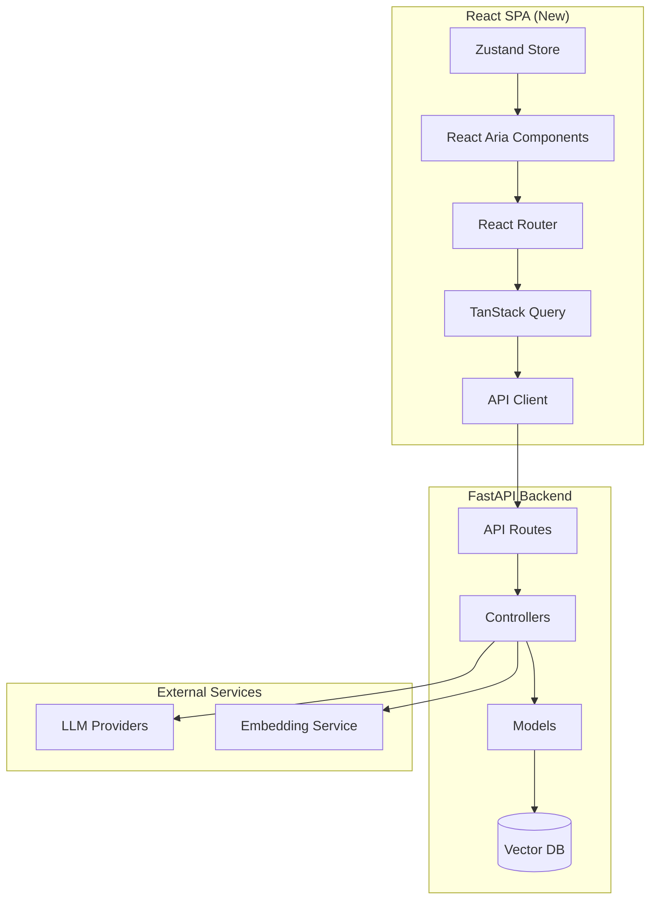
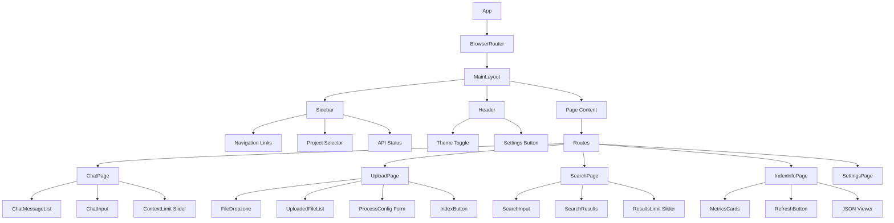
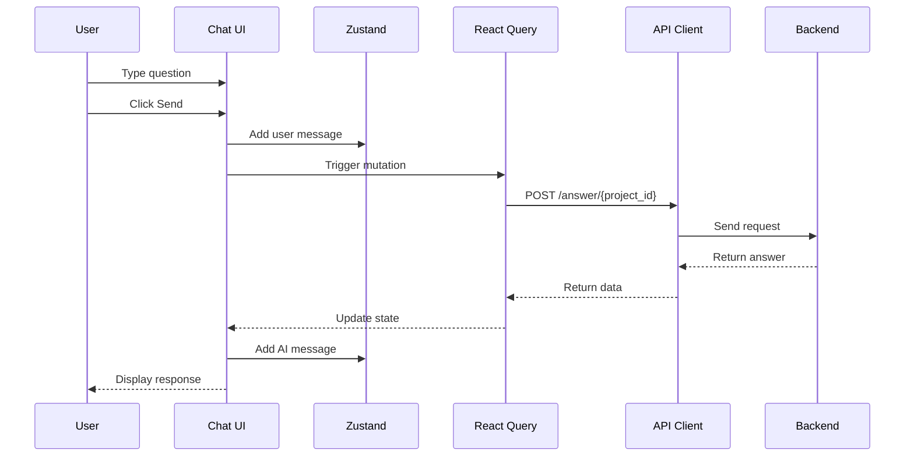
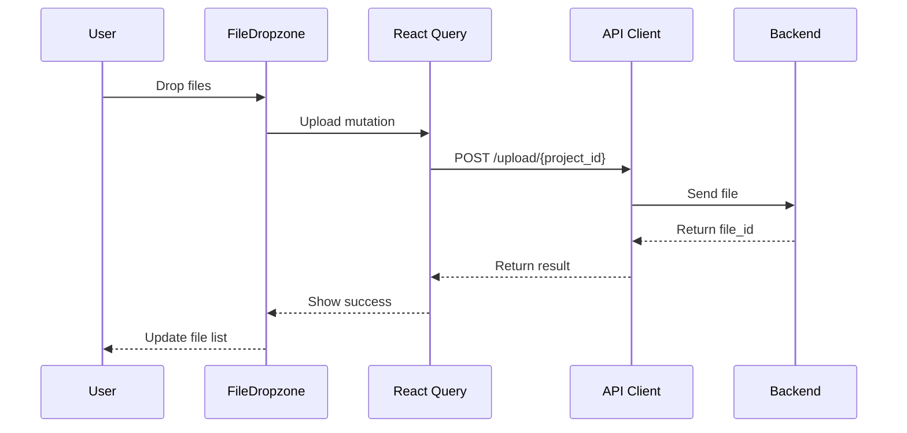

# System Architecture

## High-Level Architecture



## Component Hierarchy



## Data Flow

### Chat Flow



### File Upload Flow



## Route Structure

| Route       | Component     | Description                |
| ----------- | ------------- | -------------------------- |
| `/`         | ChatPage      | Default chat interface     |
| `/upload`   | UploadPage    | File upload and processing |
| `/search`   | SearchPage    | Semantic search            |
| `/index`    | IndexInfoPage | Vector DB info             |
| `/settings` | SettingsPage  | App configuration          |

## State Management

### Server State (React Query)

```typescript
// Query Keys
['health'] - API health status
['index', projectId] - Index info
['search', projectId, query] - Search results

// Mutations
uploadFile - File upload
processFiles - Process chunks
pushToIndex - Vector DB indexing
getAnswer - RAG answer
```

### Client State (Zustand)

```typescript
interface SettingsStore {
  apiUrl: string;
  projectId: number;
  theme: "dark" | "light";
  chatHistory: ChatMessage[];
  setApiUrl: (url: string) => void;
  setProjectId: (id: number) => void;
  toggleTheme: () => void;
  addMessage: (msg: ChatMessage) => void;
  clearHistory: () => void;
}
```

## React Aria Components Usage

### Navigation

- `Tabs` - Main navigation between features
- `ListBox` - Project selector dropdown
- `Button` - Action buttons

### Chat

- `TextField` - Message input (multi-line)
- `Button` - Send button
- `ListBox` - Message list (virtualized)
- `Slider` - Context limit control

### Upload

- `DropZone` - File drop area
- `FileTrigger` - File picker button
- `ProgressBar` - Upload progress
- `Meter` - Processing progress
- `NumberField` - Chunk size input

### Search

- `SearchField` - Search input
- `Slider` - Results limit
- `GridList` - Results grid
- `Disclosure` - Expandable result details

### Settings

- `TextField` - API URL input
- `NumberField` - Project ID
- `Switch` - Theme toggle
- `Link` - External links
