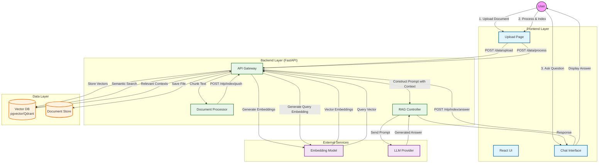

# Fehres Project Workflow

This document illustrates the end-to-end workflow of the Fehres RAG system, detailing the Data Ingestion Pipeline and the RAG Inference Pipeline.

## High-Level Workflow

The project consists of two main phases:
1.  **Data Ingestion**: Transforming raw documents into searchable vector embeddings.
2.  **RAG Inference**: Retrieving relevant contexts to answer user queries.

## Detailed Process Flows

### 1. Data Ingestion Pipeline (Upload -> Index)

This process prepares the user's data for retrieval.

1.  **Upload**: User uploads a file (PDF, TXT, etc.).
    *   Endpoint: `POST /data/upload/{project_id}`
    *   Actions: File is validated and saved to the server's storage.
2.  **Process**: The system breaks the document into smaller chunks.
    *   Endpoint: `POST /data/process/{project_id}`
    *   Parameters: `chunk_size` (default: 100), `overlap_size` (default: 20).
    *   Actions: Text extraction and splitting.
3.  **Index**: Chunks are converted to vectors and stored.
    *   Endpoint: `POST /nlp/index/push/{project_id}`
    *   Actions: Calls Embedding Service -> Inserts into Vector DB.

### 2. RAG Inference Pipeline (Question -> Answer)

This is the "Final Result" delivery to the user.

1.  **User Query**: User types a question in the `ChatPage` or `LearningAssistantChatPage`.
2.  **Retrieval**:
    *   Endpoint: `POST /nlp/index/answer/{project_id}`
    *   Action: The question is embedded using the same model as the documents.
    *   Search: The system scans the Vector DB for chunks with high cosine similarity.
3.  **Generation**:
    *   Context Assembly: Retrieved chunks are combined into a system prompt.
    *   Prompt: "Answer the question based strictly on the context below..."
    *   LLM Call: The prompt is sent to OpenAI/Gemini/Cohere.
4.  **Result**: The LLM's text response is streamed or returned to the frontend.

## Key Components

*   **Learning Assistant**: A specialized view leveraging the RAG pipeline for a specific educational corpus.
*   **Learning Books Admin**: Management interface for the educational corpus assets.
